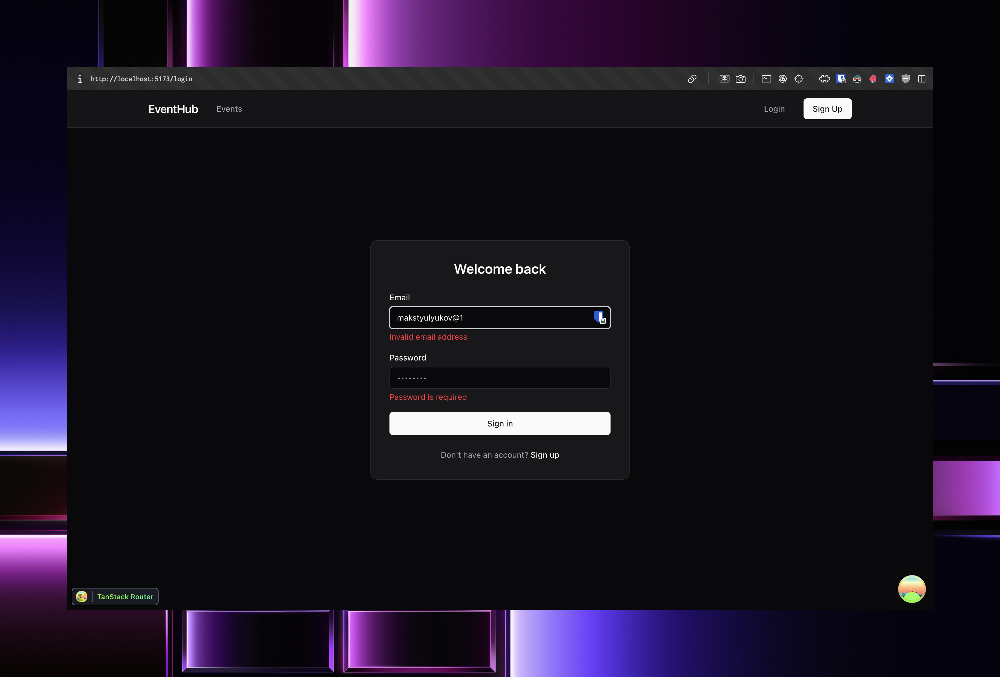
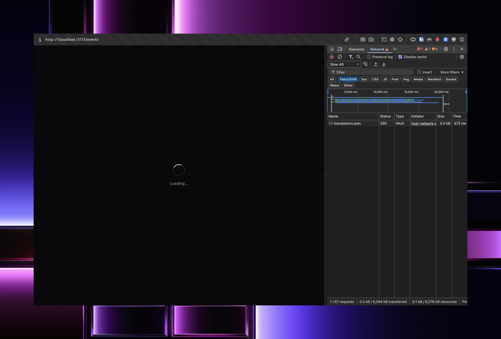
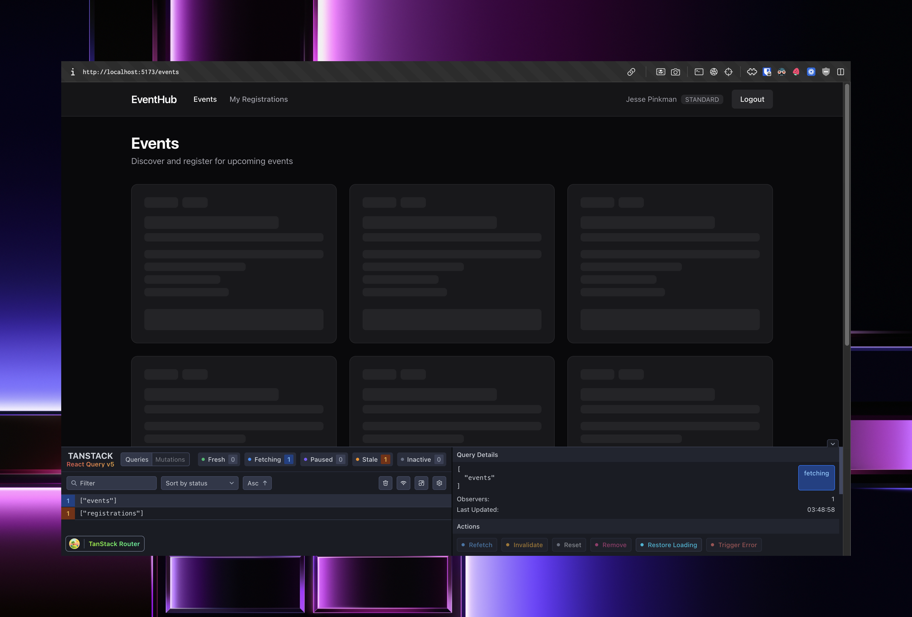
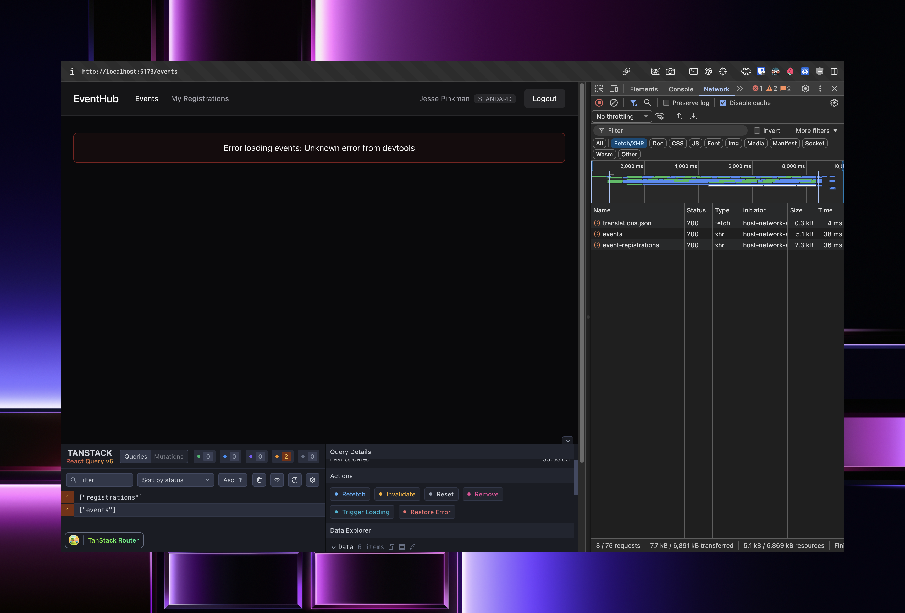
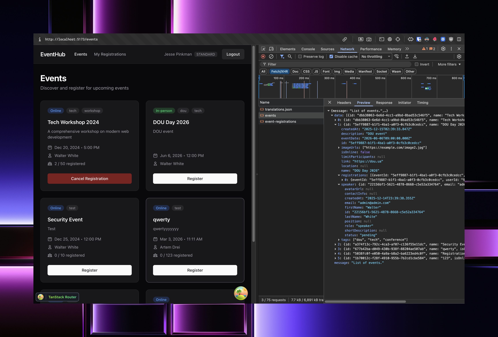

# Event Management Frontend

Full-stack integration frontend for the Event Management System, built with React, TypeScript, and modern tooling.

## Implemented Features

### Authentication
- **Login** (`/login`) - JWT-based authentication with form validation
- **Registration** (`/register`) - New user registration with password confirmation
- Zustand store for token persistence (localStorage)
- Axios interceptors for automatic token injection

### Events (Public + SPEAKER)
- **Events List** (`/events`) - Browse all events (public)
- **Create Event** (`/events/new`) - SPEAKER-only, create new events
- **Edit Event** (`/events/$eventId`) - SPEAKER-only, edit owned events
- Delete events with confirmation

### Event Registrations
- Register for events you don't own (both STANDARD and SPEAKER users)
- **My Registrations** (`/my-registrations`) - View and manage your registrations
- Add/edit comments on registrations
- Cancel registrations

## Tech Stack

- **TanStack Router** - File-based routing with type safety
- **TanStack Query** - Server state management with caching
- **React Hook Form + Zod** - Form handling with schema validation
- **Zustand** - Client state management (auth)
- **Axios** - HTTP client with interceptors
- **Tailwind CSS** - Dark mode shadcn-inspired styling

## Key Code Examples

### Axios Configuration (`src/lib/axios.ts`)

```typescript
const apiClient = axios.create({
  baseURL: import.meta.env["VITE_API_BASE_URL"],
  headers: { "Content-Type": "application/json" },
});

// Token injection via callbacks (set in App.tsx)
apiClient.interceptors.request.use((config) => {
  const token = getToken?.();
  if (token) config.headers.Authorization = token;
  return config;
});
```

### TanStack Query Hook (`src/features/events/api.ts`)

```typescript
export const useEvents = () =>
  useQuery<Event[]>({
    queryKey: ["events"],
    queryFn: async () => {
      const response = await apiClient.get<ApiResponse<Event[]>>("/events");
      return response.data.data;
    },
  });

export const useCreateEvent = () => {
  const queryClient = useQueryClient();
  const navigate = useNavigate();
  return useMutation({
    mutationFn: createEvent,
    onSuccess: () => {
      queryClient.invalidateQueries({ queryKey: ["events"] });
      navigate({ to: "/events" });
    },
  });
};
```

### Zod Schema (`src/routes/login.tsx`)

```typescript
const loginSchema = z.object({
  email: z.email("Invalid email address"),
  password: z.string().min(1, "Password is required"),
});

// Used with React Hook Form
const { register, handleSubmit, formState: { errors } } = useForm({
  resolver: zodResolver(loginSchema),
});
```

### Zustand Auth Store (`src/store/authStore.ts`)

```typescript
export const useAuthStore = create<AuthState>()(
  persist(
    (set, get) => ({
      token: null,
      user: null,
      setAuth: (token, user) => set({ token, user }),
      logout: () => set({ token: null, user: null }),
      isAuthenticated: () => get().token !== null,
    }),
    { name: "auth-storage" }
  )
);
```

## Screenshots

### 1. Form Validation (Zod)



### 2. API Error Handling


### 3. App Loading State



### 4. Skeleton Loaders



### 5. Error State



### 6. Network Tab (DevTools)



## Setup

1. Install dependencies:
   ```bash
   pnpm install
   ```

2. Create `.env` file:
   ```
   VITE_API_BASE_URL=http://localhost:4000/v1
   ```

3. Run development server:
   ```bash
   pnpm dev
   ```

4. Build for production:
   ```bash
   pnpm build
   ```

## Project Structure

```
src/
├── components/
│   ├── layout/RootLayout.tsx    # Main layout with navigation
│   └── ui/Skeleton.tsx          # Loading skeletons
├── features/
│   ├── auth/api.ts              # useLogin, useRegister hooks
│   ├── events/
│   │   ├── api.ts               # Events CRUD hooks
│   │   └── types.ts             # TypeScript types
│   └── registrations/api.ts     # Registration hooks
├── lib/
│   ├── axios.ts                 # Axios instance
│   └── apiError.ts              # Error message extraction
├── routes/
│   ├── __root.tsx               # Root layout
│   ├── events.tsx               # Events list
│   ├── events_.new.tsx          # Create event (SPEAKER)
│   ├── events_.$eventId.tsx     # Edit event (SPEAKER)
│   ├── login.tsx                # Login page
│   ├── register.tsx             # Registration page
│   └── my-registrations.tsx     # User's registrations
├── store/
│   └── authStore.ts             # Zustand auth store
└── styles/
    └── tailwind.css             # Dark theme variables
```

## Notes

- Uses TanStack Router file-based routing with underscore escape pattern (`events_.new.tsx`) to avoid parent-child nesting
- Dark mode theme inspired by shadcn/ui design system
- Error messages extracted from API response format (`errors` array)
- JWT token decoded client-side to get user info
